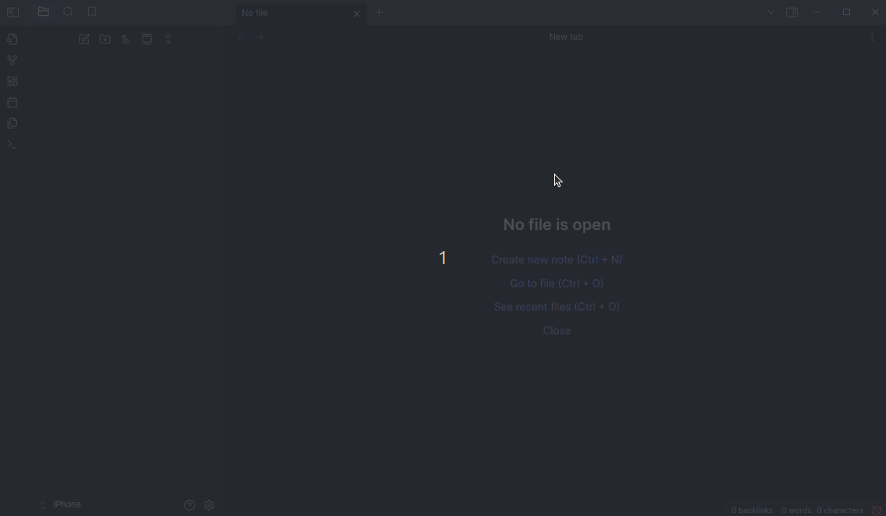

# Obsidian Course Tracker Plugin

This plugin for [Obsidian](https://obsidian.md/) automatically generates a folder and markdown file structure for a [Coursera](https://www.coursera.org/) course from its URL. Ideal for documenting and tracking your learning progress inside your vault.



## Main Features

- **Scrapes** modules, lessons, and durations from Coursera.  
- **Automatically generates** an `_index.md` file with progress checkboxes.  
- Organizes folders by module and lesson under `Courses/Coursera/`.  
- Python interpreter configurable (e.g., `python3` or full path) via the plugin settings.  
- Compatible with Windows, macOS, and Linux (Obsidian Desktop only).

## Prerequisites

1. **Obsidian Desktop** (not supported in the web version).  
2. **Python 3** installed and accessible from the terminal.  
3. Install Python packages:

   ```bash
   pip install -r requirements.txt
   ```

## Installation

1. Clone this repository:

   ```bash
   git clone https://github.com/matzalazar/obsidian-course-tracker
   ```

2. Navigate to the directory and build:

   ```bash
   cd obsidian-course-tracker/
   npm install  
   npm run build  
   ```

3. Copy **only** the build artifacts into your vault's `.obsidian/plugins` directory:

   On Linux/macOS:
   ```bash
   mkdir -p /YourVault/.obsidian/plugins/obsidian-course-tracker/
   cp main.js manifest.json /YourVault/.obsidian/plugins/obsidian-course-tracker/
   ```

   On Windows:
   ```
   C:\Users\YourUser\ObsidianVault\.obsidian\plugins\obsidian-course-tracker\
   ```

4. Restart Obsidian and enable “Course Tracker” under Community Plugins.

## Configuration

Inside Obsidian, go to **Settings → Plugins → Course Tracker Settings** and set:

- **Python Path**: command or full path to the Python interpreter (e.g., `python3` or `/usr/bin/python3`).
- **Download File**: use the “Download” button to automatically save `coursera.py` into the plugin folder if not already present.

## Output Structure

When using “Enter Course URL”, the plugin:

1. Creates the folder:

   ```
   Courses/<Platform>/<Course Title>/
   ```

2. Generates `_index.md` with content like:

   ```
   # 📘 Course Title

   **Course link:** [View on Coursera](<URL>)

   ---

   ## Module 1: Module Name

   - [ ] Lesson 1 — _Duration_
   - [ ] Lesson 2 — _Duration_
   ```

3. Adds one `.md` file per lesson with metadata and title.

Example generated structure:

```
Courses/
└── Coursera/
    └── Mathematics for Engineers/
        ├── _index.md
        ├── Module 1/
        │   ├── 00_Introduction.md
        │   └── 01_Matrices.md
        └── Module 2/
            └── 02_Determinants.md
```

## License

[MIT](./LICENSE)

## Disclaimer

This plugin is intended for personal use only. Please respect the [Coursera Terms of Service](https://www.coursera.org/about/terms).  
We do not collect or transmit any data; all processing happens locally on your machine.

## Contributions

Issues and pull requests are welcome to improve the plugin.
